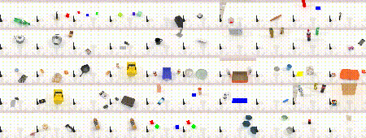

<h1 align="center">
  基于VLM的双臂机器人抓取算法设计<br>
  <b>SG-DP3: Semantic-Guided 3D Diffusion Policy</b>
</h1>

<p align="center">
  <i>融合视觉语言模型语义理解与3D扩散策略的双臂机器人操作算法</i><br>
  基于 <a href="https://github.com/RoboTwin-Platform/RoboTwin">RoboTwin 2.0</a> 双臂仿真平台开发
</p>

---

## 📚 项目简介

本仓库是毕业设计 **「基于VLM的双臂机器人抓取算法设计」** 的完整代码，提出了一种 **SG-DP3（Semantic-Guided 3D Diffusion Policy）** 算法，核心思路是将 VLM（Vision Language Model）的语义理解能力与 DP3（3D Diffusion Policy）的3D几何精度相融合，在 RoboTwin 2.0 双臂仿真平台上实现高精度的机器人抓取操作。

同时，本仓库还包含一个基于 PyQt5 开发的 **SG-DP3 智能控制台**，用于数据预处理、训练监控、仿真评估的全流程可视化管理。

### 核心创新点

1. **语义提纯（Semantic Purification）**：利用 VLM（PaliGemma / 轻量CNN）生成2D语义分割掩码，将3D点云过滤为仅包含目标物体的子集，消除背景干扰。
2. **级联解耦条件注入（Cascaded Decoupled Injection）**：在去噪网络中通过时间步动态混合语义条件和几何条件，`w_sem = τ/T_max, w_geo = 1 - w_sem`，实现从语义引导到几何精度的渐进式控制。
3. **Temporal Ensembling 推理优化**：指数加权平均重叠预测，平滑轨迹输出，配合夹爪锁定机制提升抓取稳定性。

### 算法架构总览

```
┌──────────────────────────────────────────────────────────┐
│                    SG-DP3 Pipeline                        │
│                                                           │
│  Image + Instruction                                      │
│       │                                                   │
│       ▼                                                   │
│  ┌──────────────┐    ┌──────────────┐                     │
│  │ Pi0Semantic  │───▶│  2D Mask     │                     │
│  │  Wrapper     │    └──────┬───────┘                     │
│  └──────┬───────┘           │                             │
│         │ c_sem             ▼                             │
│         │         ┌──────────────────┐                    │
│         │         │  Semantic        │                    │
│         │         │   Purification   │                    │
│         │         └────────┬─────────┘                    │
│         │                  │ purified points               │
│         │                  ▼                               │
│         │         ┌──────────────────┐                     │
│         │         │  PointNet        │                     │
│         │         │   Encoder        │───▶ c_geo          │
│         │         └──────────────────┘                     │
│         │                  │                               │
│         ▼                  ▼                               │
│  ┌─────────────────────────────────────┐                  │
│  │    Cascaded Unet1D (Denoiser)       │                  │
│  │    w_sem * c_sem + w_geo * c_geo    │                  │
│  └─────────────────────────────────────┘                  │
│         │                                                 │
│         ▼                                                 │
│    Predicted Action                                       │
└──────────────────────────────────────────────────────────┘
```

---

## 🗂️ 项目结构

```
.
├── policy/
│   └── Pi0_Dp3/                         # SG-DP3 核心算法
│       ├── deploy_policy.py              # RoboTwin 评估接口 (get_model / eval / reset_model)
│       ├── deploy_policy.yml             # 评估参数配置
│       ├── process_data.sh               # 数据预处理脚本
│       ├── train.sh                      # 训练启动脚本
│       ├── eval.sh                       # 评估启动脚本
│       ├── requirements.txt              # Python 依赖
│       ├── sg_dp3_workspace/
│       │   ├── config/
│       │   │   └── sg_dp3.yaml           # 主配置文件
│       │   ├── dataset/
│       │   │   └── multimodal_dataset.py # 多模态数据集
│       │   ├── model/
│       │   │   ├── semantic/
│       │   │   │   ├── pi0_wrapper.py    # VLM 语义编码器 (PaliGemma / 轻量CNN)
│       │   │   │   └── purification.py   # 语义提纯模块
│       │   │   ├── vision/
│       │   │   │   └── pointnet.py       # PointNet 几何编码器
│       │   │   └── diffusion/
│       │   │       ├── cascaded_unet.py  # 级联解耦 U-Net 去噪网络
│       │   │       └── ddim_scheduler.py # DDIM 调度器
│       │   ├── policy/
│       │   │   └── sg_dp3_policy.py      # SG-DP3 总体策略
│       │   ├── train_sg_dp3.py           # 训练入口
│       │   └── eval_sg_dp3.py            # 独立评估入口
│       └── scripts/
│           └── process_data.py           # 数据预处理实现
│
├── sgdp3_console/                        # SG-DP3 智能控制台 (PyQt5)
│   ├── main.py                           # 主入口
│   ├── sidebar.py                        # 侧边栏导航
│   ├── styles/
│   │   └── theme.py                      # 全局主题样式
│   └── pages/
│       ├── page_dashboard.py             # 仪表盘: 系统状态 / 数据总览
│       ├── page_preprocess.py            # 数据预处理: 自动扫描 / Zarr 转换
│       ├── page_train_monitor.py         # 训练监控: 损失曲线 / 3D 点云可视化
│       └── page_eval.py                  # 仿真评估: 成功率 / 轨迹 / 误差曲线
│
├── envs/                                 # RoboTwin 任务环境
├── script/                               # 数据采集与评估脚本
├── data/                                 # 采集数据目录
├── task_config/                          # 任务配置
├── code_gen/                             # GPT 代码生成模块
├── description/                          # 任务描述与 Prompt
└── collect_data.sh                       # 数据采集脚本
```

---

## 🛠️ 安装

### 1. 环境要求

- Python 3.8+
- CUDA 11.8 / 12.1 / 12.4
- PyTorch ≥ 2.0

### 2. 安装 RoboTwin 2.0 平台

请参考 [RoboTwin 2.0 官方安装文档](https://robotwin-platform.github.io/doc/usage/robotwin-install.html) 完成仿真平台安装（约 20 分钟）。

### 3. 安装 SG-DP3 依赖

```bash
# 安装 PyTorch (根据 CUDA 版本选择)
# CUDA 12.1:
pip install torch torchvision --index-url https://download.pytorch.org/whl/cu121

# 安装 SG-DP3 依赖
cd policy/Pi0_Dp3
pip install -r requirements.txt
```

### 4. 安装控制台依赖（可选）

```bash
pip install PyQt5 pyqtgraph PyOpenGL psutil matplotlib
```

---

## 🧑🏻‍💻 使用方法

### 🖥️ 方式一：使用智能控制台（推荐）

启动 PyQt5 可视化控制台，一站式完成数据预处理 → 训练 → 评估全流程：

```bash
cd sgdp3_console
python main.py
```

控制台提供四大功能模块：

| 模块 | 功能 |
|------|------|
| 📊 仪表盘 | 系统状态监控 (CPU/GPU/内存)、数据集总览、Checkpoint 管理、全局日志 |
| ⚙️ 数据预处理 | 自动扫描数据集、下拉选择任务/配置、Zarr 格式转换、实时终端输出 |
| 📈 训练监控 | 训练配置管理、损失曲线实时可视化、3D 点云/2D 掩码语义引导可视化 |
| 🕹️ 仿真评估 | 自动扫描 Checkpoint、成功率统计、轨迹 3D 可视化、误差曲线分析 |

### 💻 方式二：命令行操作

#### 数据采集

使用 RoboTwin 2.0 平台采集仿真数据：

```bash
bash collect_data.sh ${task_name} ${task_config} ${gpu_id}
# 示例: bash collect_data.sh beat_block_hammer demo_randomized 0
```

#### 数据预处理

将采集的原始数据转换为 Zarr 训练格式：

```bash
cd policy/Pi0_Dp3
bash process_data.sh ${task_name} ${task_config} ${expert_data_num}
# 示例: bash process_data.sh beat_block_hammer demo_clean 50
```

#### 训练

##### SG-DP3（本项目核心算法）

```bash
cd policy/Pi0_Dp3
bash train.sh ${task_name} ${task_config} ${expert_data_num} ${seed} ${gpu_id}
# 示例: bash train.sh beat_block_hammer demo_clean 50 42 0
```

##### RDT（Robotics Diffusion Transformer）

**全量微调**（需要多卡，使用 DeepSpeed ZeRO-2）：

```bash
cd policy/RDT
bash finetune.sh ${task_name} ${task_config} ${expert_data_num} ${seed} ${gpu_ids}
# 示例: bash finetune.sh beat_block_hammer demo_clean 50 42 0,1,2,3
```

**LoRA 微调**（✅ 单卡 RTX 4090 可用）：

```bash
cd policy/RDT
bash finetune_lora.sh ${task_name} ${task_config} ${expert_data_num} ${seed} ${gpu_id}
# 示例: bash finetune_lora.sh beat_block_hammer demo_clean 50 42 0
```

| 参数 | 默认值 | 说明 |
|------|--------|------|
| `--use_lora` | False | 启用 LoRA 微调 |
| `--lora_rank` | 8 | LoRA 秩（r） |
| `--lora_alpha` | 16.0 | LoRA 缩放因子 |
| `--lora_dropout` | 0.0 | LoRA Dropout |

##### pi0（OpenPI）

**全量微调**（需要多卡）：

```bash
cd policy/pi0
bash finetune.sh pi0_base_aloha_robotwin_full ${model_name} ${gpu_ids}
# 示例: bash finetune.sh pi0_base_aloha_robotwin_full my_task_full 0,1,2,3
```

**LoRA 微调**（✅ 单卡 RTX 4090 可用）：

```bash
cd policy/pi0
bash finetune_lora.sh ${model_name} ${gpu_id}
# 示例: bash finetune_lora.sh my_task_lora 0
```

> pi0 内置 LoRA 支持（`gemma_2b_lora` + `gemma_300m_lora`），训练配置名：`pi0_base_aloha_robotwin_lora`

##### pi05（OpenPI pi0.5）

**全量微调**：

```bash
cd policy/pi05
bash finetune.sh pi05_aloha_full_base ${model_name} ${gpu_id}
# 示例: bash finetune.sh pi05_aloha_full_base my_task_full 0
```

**LoRA 微调**（✅ 单卡 RTX 4090 可用）：

```bash
cd policy/pi05
bash finetune_lora.sh ${model_name} ${gpu_id}
# 示例: bash finetune_lora.sh my_task_lora 0
```

> pi05 训练配置名：`pi05_aloha_lora_base`，使用 `gemma_2b_lora` + `gemma_300m_lora`

##### 训练方式对比

| 策略 | 全量微调 | LoRA 微调 | 显存需求（估算） |
|------|---------|-----------|----------------|
| **SG-DP3** | `train.sh` | — | ~8GB（单卡） |
| **RDT** | `finetune.sh`（DeepSpeed ZeRO-2，多卡） | `finetune_lora.sh`（单卡） | LoRA: ~18GB |
| **pi0** | `finetune.sh`（多卡） | `finetune_lora.sh`（单卡） | LoRA: ~20GB |
| **pi05** | `finetune.sh`（单卡） | `finetune_lora.sh`（单卡） | LoRA: ~20GB |

> **提示**：LoRA 微调仅更新少量低秩适配器参数（通常 < 总参数量的 1%），可大幅降低显存占用，适合在单张 RTX 4090 (24GB) 上进行实验。

#### 评估

在 RoboTwin 仿真环境中评估训练好的模型：

```bash
cd policy/Pi0_Dp3
bash eval.sh ${task_name} ${task_config} ${ckpt_setting} ${expert_data_num} ${seed} ${gpu_id}
# 示例: bash eval.sh beat_block_hammer demo_clean sg_dp3-train 50 42 0
```

---

## 🔬 SG-DP3 算法详解

### 模块组成

#### 1. VLM 语义编码器 (`pi0_wrapper.py`)

基于 PaliGemma（SigLIP + Gemma）视觉语言模型，冻结 VLM 权重，附加自定义 MLP 分割头：
- 输入：RGB 图像 + 自然语言指令
- 输出：2D 语义分割掩码 + 语义特征 `c_sem`
- 支持 **轻量模式**（纯 PyTorch CNN，无需 HuggingFace 认证）和 **完整模式**（PaliGemma，需约 6GB 显存）

#### 2. 语义提纯模块 (`purification.py`)

核心创新 —— 将 2D 语义掩码映射到 3D 空间，过滤背景点云：
- 利用可学习投影矩阵将 3D 点投影到 2D 平面
- 用 2D 掩码过滤投影点，提取目标相关点云
- 当过滤后点数不足时，使用有放回重采样确保点数达标

#### 3. PointNet 几何编码器 (`pointnet.py`)

编码语义提纯后的3D点云，输出几何特征 `c_geo`。迁移自 DP3 基线，核心结构保持不变。

#### 4. 级联解耦去噪网络 (`cascaded_unet.py`)

核心创新 —— 时间步动态条件混合：
- 通过 `w_sem = τ/T_max` 和 `w_geo = 1 - w_sem` 动态调节两种条件权重
- 早期去噪步骤侧重语义引导（大尺度结构），后期侧重几何精度（精细调整）
- 使用级联自适应层归一化（Cascaded AdaLN）注入条件

#### 5. 推理优化 (`deploy_policy.py`)

- **Temporal Ensembling**：指数加权平均重叠预测，平滑轨迹
- **夹爪锁定**：一旦夹爪闭合（抓到物体），强制保持闭合状态
- **滑动窗口推理**：维护最近 `n_obs_steps` 帧观测窗口

### 关键超参数

| 参数 | 默认值 | 说明 |
|------|--------|------|
| `horizon` | 8 | 动作序列总长度 |
| `n_action_steps` | 6 | 实际执行步数 |
| `n_obs_steps` | 3 | 观测步数 |
| `num_train_timesteps` | 100 | 训练扩散步数 |
| `num_inference_steps` | 10 | 推理扩散步数 |
| `semantic_feature_dim` | 576 | 语义特征维度 |
| `purification_num_points` | 1024 | 提纯后最少点数 |

---

## 📊 平台说明

本项目基于 [RoboTwin 2.0](https://robotwin-platform.github.io/) 双臂机器人仿真平台开发，包含 50+ 操作任务，支持强域随机化。

<p align="center">
  
</p>

---

## 👍 致谢

- **仿真平台**：[RoboTwin 2.0](https://github.com/RoboTwin-Platform/RoboTwin) — 双臂机器人操作仿真与基准测试平台
- **基线算法**：[DP3](https://robotwin-platform.github.io/doc/usage/DP3.html)（3D Diffusion Policy）和 [Pi0](https://robotwin-platform.github.io/doc/usage/Pi0.html)（VLM Policy）
- **VLM 模型**：[PaliGemma](https://huggingface.co/google/paligemma-3b-mix-224)（Google 视觉语言模型）

---

## 📄 参考文献

```bibtex
@article{chen2025robotwin,
  title={Robotwin 2.0: A scalable data generator and benchmark with strong domain randomization for robust bimanual robotic manipulation},
  author={Chen, Tianxing and Chen, Zanxin and Chen, Baijun and Cai, Zijian and Liu, Yibin and others},
  journal={arXiv preprint arXiv:2506.18088},
  year={2025}
}

@InProceedings{Mu_2025_CVPR,
    author    = {Mu, Yao and Chen, Tianxing and Chen, Zanxin and Peng, Shijia and others},
    title     = {RoboTwin: Dual-Arm Robot Benchmark with Generative Digital Twins},
    booktitle = {CVPR},
    year      = {2025},
    pages     = {27649-27660}
}
```

---

## 🏷️ 许可证

本项目基于 MIT 许可证发布。详见 [LICENSE](./LICENSE)。
